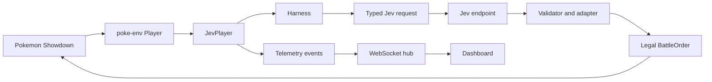

# Pokemon Showdown Jev Agent

An autonomous Gen 9 Random Battles agent for [Pokemon Showdown](https://pokemonshowdown.com/), powered by the Jev AI (System One Model by TypeSafe AI) decision endpoint.

The supported workflow is the live dashboard. A dedicated Showdown account connects to the public ladder, the agent observes a real battle, sends a structured decision request to Jev, validates the returned choice, and submits a legal order. The dashboard shows the complete observable path.

<table>
  <tr>
    <td width="33.3%">
      <video src="https://github.com/user-attachments/assets/9ad2418c-60ad-4433-a87d-c72c2cba9da2" controls width="100%"></video>
    </td>
    <td width="33.3%">
      <video src="https://github.com/user-attachments/assets/ebf87f25-6a13-4b3e-bcd7-16f1603ef615" controls width="100%"></video>
    </td>
    <td width="33.3%">
      <video src="https://github.com/user-attachments/assets/436f6ea9-8621-4a03-89e3-9605a757ba95" controls width="100%"></video>
    </td>
  </tr>
</table>

## What the system does

For every battle turn, the agent:

1. Receives the current battle request from `poke-env`.
2. Enumerates every legal move and switch action.
3. Computes deterministic, observable facts for each candidate.
4. Serializes a structured battle snapshot while preserving opponent fog of war.
5. Sends the snapshot and typed criteria to the Jev endpoint.
6. Validates the returned choice against the legal candidate set.
7. Submits the resolved order and publishes telemetry to the dashboard.

If Jev is unavailable, times out, returns malformed data, or selects an illegal action, the adapter uses the deterministic fallback ladder. The dashboard labels this as a fallback. It never presents a fallback choice as if it were a successful Jev decision.

## Supported workflow

This repository is intended to run the public matchmaking flow through the dashboard. It is not a claim that the agent is a strong competitive player. Provider availability, rate limits, network conditions, battle variance, and incomplete opponent information all affect a live run.

The repository contains historical evaluation artifacts and internal experiment code, but this README does not present those results as evidence of product quality or strategic strength. Harness correctness and decision observability must be evaluated separately from playing strength.

## Requirements

- Windows PowerShell, macOS, or Linux.
- Python 3.10 or newer. Python 3.11 is recommended.
- [`uv`](https://docs.astral.sh/uv/) for environment and dependency management.
- A dedicated Pokemon Showdown account for public matchmaking.
- Access to the configured Jev endpoint and its authentication token.
- Network access to Pokemon Showdown and the Jev endpoint.

Use a dedicated account. Do not use a personal competitive account or commit credentials to the repository.

## Setup

From the repository root:

```powershell
# Create a project-local environment
uv venv .venv --python 3.11
.\.venv\Scripts\Activate.ps1

# Install the package and development dependencies
uv pip install --python .venv\Scripts\python.exe -e ".[dev]"

# Create the local configuration file
Copy-Item .env.example .env
```

For bash-compatible shells, activate the environment with:

```bash
source .venv/bin/activate
uv pip install -e ".[dev]"
cp .env.example .env
```

Edit `.env` with the Showdown account and Jev settings. `.env` is ignored by Git and must stay local.

## Configuration

| Variable | Default | Purpose |
| --- | --- | --- |
| `SHOWDOWN_USERNAME` | empty | Showdown username used for matchmaking. Required by the live dashboard. |
| `SHOWDOWN_PASSWORD` | empty | Password for the dedicated Showdown account. Required by the live dashboard. |
| `SHOWDOWN_SERVER_URL` | `sim3.psim.us:8000` | Showdown server host. Public hosts use the public Showdown configuration. `localhost` and `127.0.0.1` select the local configuration used by tests. |
| `JEV_ENDPOINT` | `https://opencode.ai/zen/v1/systemone` | Typed Jev decision endpoint. |
| `JEV_MODEL` | `jev-1.13-free` | Jev model identifier sent to the endpoint. |
| `JEV_AUTH_TOKEN` | `Bearer public` | Endpoint token. Bare tokens are automatically prefixed with `Bearer `. |
| `JEV_TIMEOUT_SECONDS` | `10.0` | Per-turn Jev timeout. A timeout enters the labeled fallback path. |
| `BATTLE_FORMAT` | `gen9randombattle` | Showdown format used by the player. |
| `DASHBOARD_PORT` | `8000` | Local dashboard port. |

The dashboard redacts credential-like fields from telemetry. This does not replace good secret handling: keep `.env` private and rotate exposed credentials immediately.

## Run the live dashboard

```powershell
python -m jev_showdown.main serve --port 8000
```

Open [http://localhost:8000](http://localhost:8000), then select **START JEV BATTLE**.

The lifecycle is observable in the dashboard:

```text
READY
  -> CONNECTING TO SHOWDOWN
  -> AUTHENTICATING
  -> SELECTING GEN 9 RANDOM BATTLE
  -> SEARCHING FOR OPPONENT
  -> MATCH FOUND - INITIALIZING BATTLE
  -> JEV PLAYING
  -> READY
```

Only one live battle session is started at a time. Connection, authentication, account, provider, and search failures are surfaced as status errors instead of leaving the start button silently stuck.

## High-level architecture



### `JevPlayer`

[`src/jev_showdown/agent.py`](src/jev_showdown/agent.py) owns the per-turn orchestration. It connects the battle request, candidate generation, deterministic facts, snapshot serialization, Jev request, validation, fallback resolution, order submission, and telemetry callbacks.

### Harness

The harness is the deterministic evidence layer. It is responsible for facts the application can calculate or observe, including:

- legal moves and switches;
- type effectiveness and other matchup facts;
- damage ranges and KO checks where the required information is available;
- HP fractions, request metadata, state versions, and battle identifiers;
- hidden-information markers for opponent data that has not been revealed;
- a stable structured input for Jev.

The harness does not guess hidden opponent information. Unknown values remain unknown and are shown as such in telemetry and the dashboard.

### Jev

The Jev client in [`src/jev_showdown/decision/`](src/jev_showdown/decision/) sends a typed request directly to the configured endpoint. A valid response can contain:

- the selected legal action;
- confidence;
- a probability distribution over the legal candidates;
- latency, token, cost, and raw response metadata after sensitive fields are redacted for dashboard use.

Jev is not routed through a chat loop or an invented reasoning display. The dashboard shows returned fields and observable validation results only.

### Validation and fallback

The validator checks action identity, legal-candidate membership, response freshness, probability validity, and the expected request fingerprint. When Jev cannot provide a usable legal choice, the adapter resolves an order using the deterministic fallback strategy. This keeps the battle moving while preserving the distinction between Jev output and harness behavior.

## Dashboard guide

The live view is organized into three responsive evidence columns on desktop:

- **Live Showdown**: the official Showdown battle renderer and its message history.
- **Jev**: the returned decision, confidence, probability distribution, validation result, submitted order, response metadata, and run reliability.
- **System Harness**: the observed public state, calculated facts, legal action set, and Jev handoff summary.

The columns use equal-height responsive cards on wide screens. Jev and Harness content scrolls inside its card so the page remains usable at laptop and desktop heights. Smaller landscape screens switch to a battle-plus-evidence rail, and narrow screens stack the panels.

Use **INSPECT** or the panel detail links to open the complete structured evidence. The live view is intentionally compact; the inspection drawer is the full technical record for requests, facts, Jev input, Jev response, validation, submitted order, protocol frames, raw events, and run metrics.

The official Showdown renderer owns the battle scene. The custom dashboard is an observability console around it, not a replacement battle client and not a second invented battle history.

## Telemetry and data safety

The dashboard receives state through the FastAPI WebSocket hub. The projector in [`src/jev_showdown/web/dashboard_state.py`](src/jev_showdown/web/dashboard_state.py) creates a stable, JSON-safe, redacted projection for the browser.

Important rules:

- Credential-like response fields are redacted before dashboard publication.
- Fallbacks are visibly labeled and counted separately from valid Jev choices.
- Invalid or rejected probability maps are not silently repaired in the dashboard.
- Hidden opponent information is not converted into fabricated certainty.
- Raw Showdown protocol frames are filtered to the relevant battle room before dashboard use.
- Dashboard history is based on observed protocol events such as moves, damage, status, stat changes, switches, faints, and turn markers.

## Known limitations

- Public matchmaking requires a working Showdown account, network access, and a reachable public server.
- Jev availability and rate limits are outside this repository's control. HTTP errors and timeouts trigger fallback behavior.
- A fallback decision proves that the harness kept the battle moving. It is not evidence of Jev strategic quality.
- Opponent team information is incomplete until Showdown reveals it. The system preserves that uncertainty.
- Damage and KO calculations depend on the information available in the current battle state. Incomplete-information estimates are labeled accordingly.
- A probability chart is shown only when the returned map is valid for the legal candidate set. Rejected or missing maps are displayed as missing or rejected, not replaced with invented percentages.
- The dashboard is an observability surface. It does not expose private chain-of-thought or claim to explain reasoning that Jev did not return.
- The repository does not currently make a reliable strategic-strength claim from the stored evaluation artifacts.

## Repository structure

```text
src/jev_showdown/
|-- agent.py                       Per-turn JevPlayer orchestration
|-- config.py                      Environment loading and server selection
|-- main.py                        Supported CLI and live BattleOrchestrator
|-- battle/
|   |-- candidates.py              Legal moves and switches
|   |-- facts.py                   Deterministic candidate facts
|   |-- beliefs.py                 Hidden-information ledger
|   |-- consequences.py            Action consequence projections
|   |-- snapshot.py                Structured Jev input
|   |-- validator.py               Choice and order validation
|-- decision/
|   |-- opencode_jev.py            Direct Jev endpoint client
|   |-- protocol.py                Typed response validation
|-- strategy/fallback.py           Deterministic fallback ladder
|-- telemetry/
|   |-- events.py                  Battle-line scanning and turn history
|   |-- frames.py                  Raw protocol frame handling
|   |-- recording.py               Event/request-response recording
|   |-- serialization.py           JSON-safe telemetry conversion
|-- web/
    |-- dashboard_state.py         Truthful redacted dashboard projection
    |-- dashboard_stream.py        Dashboard state/event streaming
    |-- server.py                  FastAPI app and WebSocket hub
    |-- static/index.html          Dashboard shell
    |-- static/style.css            Responsive dashboard styling
    |-- static/dashboard/           Browser render, state, chart, and inspector code
    |-- static/showdown/             Vendored official Showdown battle assets
    |-- static/showdown-renderer.js  Official battle surface integration

tests/
|-- unit/                          Component and contract tests
|-- integration/                   Dashboard and end-to-end battle tests
|-- fixtures/                      Reusable battle and dashboard fixtures

docs/
|-- design/                        Product contracts and dashboard design
|-- research/                      Research and architecture notes
|-- superpowers/                   Historical implementation plans and specs

artifacts/                         Stored evaluation and replay evidence
benchmarks/                        Internal evaluation scripts, not part of supported workflow
```

## Tests and maintenance

Run the complete suite from the repository root:

```powershell
uv run --extra dev python -m pytest -q
```

The suite covers decision contracts, legal candidate generation, deterministic facts, snapshot serialization, Jev validation, fallback behavior, telemetry, public matchmaking lifecycle, the WebSocket dashboard, responsive frontend contracts, and simulated end-to-end battles.

When changing the decision contract, update the typed protocol, its tests, the dashboard projection, and the inspection view together. When changing dashboard layout or data presentation, keep the official Showdown ownership boundary intact and add a frontend regression test for the affected DOM or CSS contract.

When changing live behavior, preserve these invariants:

1. Every submitted order is legal or comes from the documented fallback path.
2. Dashboard values are source-backed and redacted.
3. Unknown information is not turned into a guess.
4. Jev output, adapter validation, and harness evidence remain distinguishable.
5. A provider failure cannot silently appear as a successful Jev decision.

Generated local directories such as `.venv`, `.pytest_cache`, browser profiles, worktrees, and local environment files are not application source. Keep them out of commits.

## Attribution

- Pokemon Showdown battle protocol and ladder: [pokemonshowdown.com](https://pokemonshowdown.com/).
- Python battle integration: [poke-env](https://github.com/PokeEngines/poke-env), MIT licensed.
- Pokemon sprite assets: the official [Pokemon Showdown sprite directory](https://play.pokemonshowdown.com/sprites/xyani/) and [Smogon sprite repository](https://github.com/smogon/sprites).

Pokemon and Pokemon character names are trademarks of Nintendo and The Pokemon Company. This is a fan-made research and observability tool and is not affiliated with or endorsed by them.
